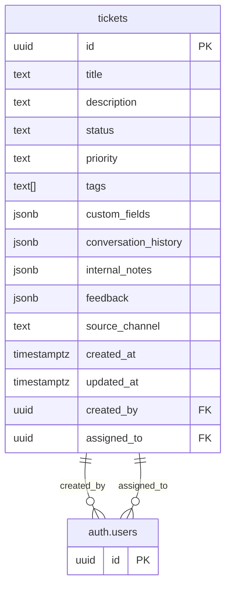

# Database Schema Documentation

## Ticket System Schema



## Tables

### tickets

Core table for storing support tickets. Designed for flexibility while maintaining structure for essential fields.

#### Fields
- `id`: UUID, primary key, auto-generated
- `title`: Text, required, ticket summary
- `status`: Text, required, enum:
  - `new`: Ticket created but not yet assigned to support staff
  - `open`: Assigned to support staff and being worked on
  - `pending`: Waiting for customer reply
  - `closed`: Issue has been resolved and ticket is closed
- `priority`: Text, required, enum:
  - low
  - medium
  - high
- `tags`: Text array, optional, for categorization and filtering
- `custom_fields`: JSONB, optional, for flexible metadata storage
- `conversation_history`: JSONB, stores all messages and internal notes in the format:
  ```json
  {
    "messages": [
      {
        "id": "uuid",
        "content": "message text",
        "created_at": "timestampz",
        "created_by": "user_id",
        "attachments": []
      }
    ]
  }
  ```
- `internal_notes`: JSONB, stores internal staff-only notes in the format:
  ```json
  {
    "notes": [
      {
        "id": "uuid",
        "content": "text content",
        "created_at": "timestamptz",
        "created_by": "user_id"
      }
    ]
  }
  ```
- `feedback`: JSONB, stores customer feedback in the format:
  ```json
  {
    "rating": 1-5,
    "comment": "text feedback",
    "submitted_at": "timestamptz"
  }
  ```
- `source_channel`: Text, tracks where the ticket originated from (e.g., email, web, chat, widget)
- `created_at`: Timestampz (with timezone), auto-set on creation
- `updated_at`: Timestampz (with timezone), auto-updated
- `created_by`: UUID, references auth.users, ticket creator
- `assigned_to`: UUID, references auth.users, assigned support staff

#### Relationships
- Links to Supabase auth.users table for both creator and assignee

#### Notes
- Uses JSONB for custom fields to maintain flexibility
- Simple array for tags as per MVP requirements
- Predefined status and priority values for simplicity
- Automatic timestamp management for created_at and updated_at
- Conversation history stored as JSONB for flexibility and simpler querying
