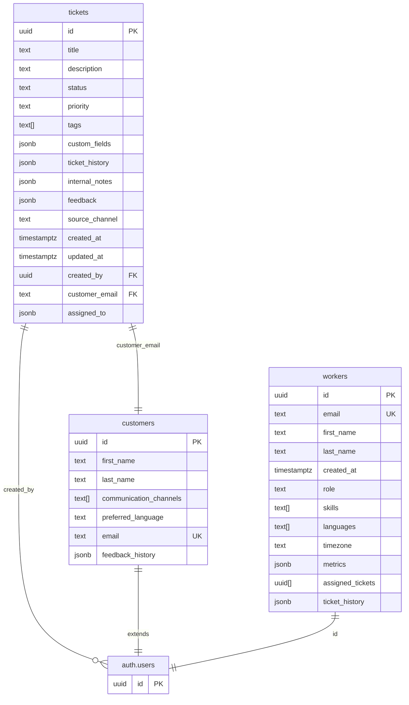

# Database Schema Documentation

## Ticket System Schema



## Tables

### tickets

Core table for storing support tickets. Designed for flexibility while maintaining structure for essential fields.

#### Fields
- `id`: UUID, primary key, auto-generated
- `title`: Text, required, ticket summary
- `description`: Text, required, detailed explanation of the ticket/issue
- `status`: Text, required, enum:
  - `new`: Ticket created but not yet assigned to support staff
  - `open`: Assigned to support staff and being worked on
  - `pending`: Waiting for customer reply
  - `closed`: Issue has been resolved and ticket is closed
- `priority`: Text, required, enum:
  - low
  - medium
  - high
- `tags`: Text array, optional, for categorization and filtering
- `custom_fields`: JSONB, optional, for flexible metadata storage
- `ticket_history`: JSONB, stores all ticket events chronologically in the format:
  ```json
  {
    "events": [
      {
        "id": "uuid",
        "type": "message",
        "content": "message text",
        "created_at": "timestampz",
        "created_by_uuid": "user_id",
        "created_by_first_name":"first_name",
        "created_by_last_name":"last_name",
        "role": "agent" | "customer",
        "visibility": "public",
        "attachments": []
      },
      {
        "id": "uuid",
        "type": "status-update",
        "old_value": "new",
        "new_value": "open",
        "created_at": "timestampz",
        "created_by_uuid": "user_id",
        "created_by_first_name":"first_name",
        "created_by_last_name":"last_name",
        "role": "agent" | "customer",
        "visibility": "public"
      },
      {
        "id": "uuid",
        "type": "field-added",
        "field_name": "custom_field_name",
        "new_value": "field value",
        "created_at": "timestampz",
        "created_by_uuid": "user_id",
        "created_by_first_name":"first_name",
        "created_by_last_name":"last_name",
        "role": "agent" | "customer",
        "visibility": "private"
      },
      {
        "id": "uuid",
        "type": "field-removed",
        "field_name": "custom_field_name",
        "old_value": "field value",
        "created_at": "timestampz",
        "created_by_uuid": "user_id",
        "created_by_first_name":"first_name",
        "created_by_last_name":"last_name",
        "role": "agent" | "customer",
        "visibility": "private"
      },
      {
        "id": "uuid",
        "type": "assignment-added",
        "agent_id": "user_id",
        "created_at": "timestampz",
        "created_by_uuid": "user_id",
        "created_by_first_name":"first_name",
        "created_by_last_name":"last_name",
        "role": "agent" | "customer",
        "visibility": "public"
      },
      {
        "id": "uuid",
        "type": "assignment-removed",
        "agent_id": "user_id",
        "created_at": "timestampz",
        "created_by_uuid": "user_id",
        "created_by_first_name":"first_name",
        "created_by_last_name":"last_name",
        "role": "agent" | "customer",
        "visibility": "public"
      },
      {
        "id": "uuid",
        "type": "note-added",
        "content": "note text",
        "created_at": "timestampz",
        "created_by_uuid": "user_id",
        "created_by_first_name":"first_name",
        "created_by_last_name":"last_name",
        "role": "agent" | "customer",
        "visibility": "private"
      }
    ]
  }
  ```

  ##### Event Types
  The `type` field in ticket history events is flexible and can be extended. Initial event types include:
  
  1. `message`: Regular conversation messages
     - Required fields: id, type, content, created_at, created_by_uuid, created_by_first_name, created_by_last_name, role, visibility, attachments
  
  2. `status-update`: Changes to ticket status
     - Required fields: id, type, old_value, new_value, created_at, created_by_uuid, created_by_first_name, created_by_last_name, role, visibility
  
  3. `field-added`: New field added to custom_fields
     - Required fields: id, type, field_name, new_value, created_at, created_by_uuid, created_by_first_name, created_by_last_name, role, visibility
  
  4. `field-removed`: Field removed from custom_fields
     - Required fields: id, type, field_name, old_value, created_at, created_by_uuid, created_by_first_name, created_by_last_name, role, visibility
  
  5. `assignment-added`: Agent added to ticket assignments
     - Required fields: id, type, agent_id, created_at, created_by_uuid, created_by_first_name, created_by_last_name, role, visibility
  
  6. `assignment-removed`: Agent removed from ticket assignments
     - Required fields: id, type, agent_id, created_at, created_by_uuid, created_by_first_name, created_by_last_name, role, visibility
  
  7. `note-added`: Internal note added to ticket
     - Required fields: id, type, content, created_at, created_by_uuid, created_by_first_name, created_by_last_name, role, visibility (always "private")

  ##### Event Visibility
  Each event has a visibility field that can be:
  - `public`: Visible to both customers and support staff
  - `private`: Visible only to support staff (internal notes, system events, etc.)

  ##### Event Role
  Each event must specify the role of the creator:
  - `agent`: Event created by a support staff member
  - `customer`: Event created by a customer

  ##### Notes on Ticket History
  - Events are stored chronologically in a single array
  - Each event must have a unique ID
  - The event type system is extensible - new types can be added without schema changes
  - Old and new values are stored for auditing when applicable
  - Assignment changes track individual additions/removals rather than full assignment list changes
  - The visibility system allows for proper access control of sensitive information
- `internal_notes`: JSONB, stores internal staff-only notes in the format:
  ```json
  {
    "notes": [
      {
        "id": "uuid",
        "content": "text content",
        "created_at": "timestamptz",
        "created_by": "user_id"
      }
    ]
  }
  ```
- `feedback`: JSONB, stores customer feedback in the format:
  ```json
  {
    "rating": 1-5,
    "comment": "text feedback",
    "submitted_at": "timestamptz"
  }
  ```
- `source_channel`: Text, tracks where the ticket originated from (e.g., email, web, chat, widget)
- `created_at`: Timestampz (with timezone), auto-set on creation
- `updated_at`: Timestampz (with timezone), auto-updated
- `created_by`: UUID, references auth.users, ticket creator
- `customer_email`: Text, references customers(email), provides an additional way to link tickets to customers
- `assigned_to`: JSONB, stores an array of worker details in format:
  ```json
  [
    {
      "id": "123e4567-e89b-12d3-a456-426614174000",
      "first_name": "Jane",
      "last_name": "Smith"
    }
  ]
  ```

#### Relationships
- Links to Supabase auth.users table for both creator and assignee
- Links to customers table via customer_email for customer information

#### Notes
- Uses JSONB for custom fields to maintain flexibility
- Simple array for tags as per MVP requirements
- Predefined status and priority values for simplicity
- Automatic timestamp management for created_at and updated_at

### customers

Core table for storing customer information. Extends the auth.users table with additional customer-specific fields.

#### Fields
- `id`: UUID, primary key, references auth.users(id)
- `first_name`: Text, required, customer's first name
- `last_name`: Text, required, customer's last name
- `communication_channels`: Text array, stores the channels customer has used (e.g., 'email', 'chat', 'widget')
- `preferred_language`: Text, customer's preferred language for communication
- `email`: Text, required, unique, customer's email address
- `feedback_history`: JSONB, stores customer's feedback history in the format:
  ```json
  {
    "feedback": [
      {
        "rating": 1-5,
        "comment": "text feedback",
        "submitted_at": "timestamptz",
        "ticket_id": "uuid"
      }
    ]
  }
  ```

#### Relationships
- Extends Supabase auth.users table (one-to-one relationship)
- Linked to tickets table via email for ticket history

#### Notes
- Uses array for communication channels to track all channels used by customer
- Feedback history stored as JSONB for flexibility and simpler querying
- Links to auth.users for authentication and base user information

### workers

Stores information about support agents and administrators.

#### Fields

| Field | Type | Description | Constraints |
|-------|------|-------------|-------------|
| id | UUID | Primary key, links to Supabase auth | PRIMARY KEY, NOT NULL |
| email | TEXT | Worker's email address | UNIQUE, NOT NULL |
| first_name | TEXT | Worker's first name | NOT NULL |
| last_name | TEXT | Worker's last name | NOT NULL |
| created_at | TIMESTAMPTZ | When the worker was added | NOT NULL, DEFAULT now() |
| role | TEXT | Worker's role in the system ('agent' or 'admin') | NOT NULL |
| skills | TEXT[] | Array of skill tags | DEFAULT '{}' |
| languages | TEXT[] | Languages the worker can communicate in | DEFAULT '{}' |
| timezone | TEXT | Worker's timezone (e.g., 'America/New_York') | NOT NULL |
| metrics | JSONB | Flexible storage for worker performance metrics | DEFAULT '{}' |
| assigned_tickets | UUID[] | Array of currently assigned ticket IDs | DEFAULT '{}' |
| ticket_history | JSONB | Historical record of resolved tickets with feedback | DEFAULT '[]' |

#### Relationships
- `id` links to Supabase auth.users table for authentication

#### Ticket History Structure
The `ticket_history` JSONB array contains records of all tickets resolved by the worker. Each entry follows this structure:
```json
[
  {
    "ticket_id": "uuid",
    "title": "Original ticket title",
    "resolved_at": "timestamptz",
    "resolution_time": "interval",  // Time between assignment and resolution
    "feedback": {
      "rating": 5,
      "comment": "Very helpful explanation",
      "submitted_at": "timestamptz"
    }
  }
]
```

Notes on ticket tracking:
- `assigned_tickets`: Contains UUIDs of all tickets currently assigned to the worker
- `ticket_history`: Maintains a complete record of resolved tickets including:
  - Basic ticket information (ID, title)
  - Resolution timing details (stored as PostgreSQL interval)
  - Customer feedback when available
- Resolution time uses PostgreSQL's interval type for accurate duration tracking
- All timestamps use timestamptz for timezone-aware datetime tracking

#### Example
```json
{
  "id": "123e4567-e89b-12d3-a456-426614174000",
  "email": "jane.smith@company.com",
  "first_name": "Jane",
  "last_name": "Smith",
  "created_at": "2025-01-21T00:00:00Z",
  "role": "agent",
  "skills": ["technical", "billing", "api"],
  "languages": ["en", "es"],
  "timezone": "America/New_York",
  "metrics": {},
  "assigned_tickets": ["ticket-uuid-1", "ticket-uuid-2"],
  "ticket_history": [
    {
      "ticket_id": "resolved-ticket-uuid",
      "title": "Example Ticket",
      "resolved_at": "2025-01-22T12:00:00Z",
      "resolution_time": "2 hours 30 minutes",
      "feedback": {
        "rating": 5,
        "comment": "Excellent support",
        "submitted_at": "2025-01-22T13:00:00Z"
      }
    }
  ]
}
```
